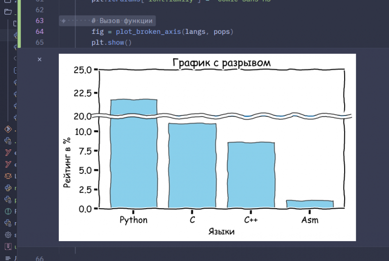

# Matplotlib Broken Axis Histogram

A simple example of a Matplotlib histogram with a broken Y-axis to visualize outliers without losing detail in the main distribution.



## Requirements

- matplotlib
- numpy

## Run

```bash
python broken_axis_plot.py
